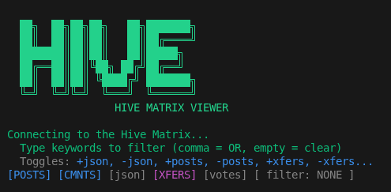
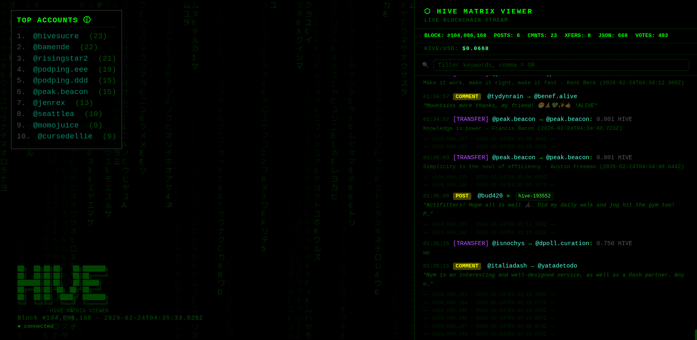
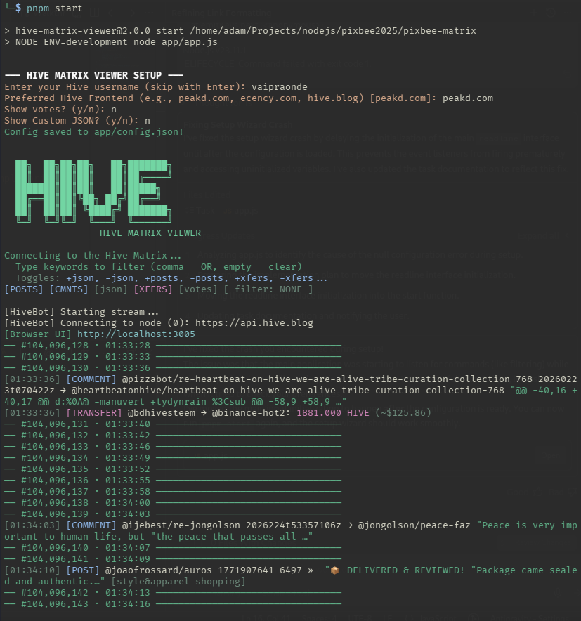

# 🟩 Hive Matrix Viewer

> A high-performance, real-time terminal & browser viewer for the [Hive blockchain](https://hive.io) — stream live transactions in Matrix-style, right in your console and web browser.



---

## 🚀 Features

- **Matrix Terminal Feed**: Live-streaming operation feed with enhanced colors (Green for JSON, Yellow/Cyan for Votes, Blue for Posts).
- **🕸 Web Dashboard**: Parallel browser UI with Matrix rain, live operation feed, and interactive toggles.
- **🐋 Whale Alerts**: Massive transfers highlighted in bright red with distinctive Whale emoji formatting.
- **🏆 Live Leaderboard**: Real-time ranking of the most active accounts in the current session (top-left on browser).
- **📈 Price Ticker**: Live HIVE/USD price tracking via CoinGecko, shown in both Terminal stats and Browser UI.
- **🔗 Clickable Links**: Intelligent OSC 8 hyperlinking (Alt+Click on most terminals) — now refined to highlight only the @username.
- **🛡️ Sticky Scroll**: Advanced feed logic prevents the UI from jumping to the bottom while you're reading.



---

## 🛠 Quick Start

```bash
pnpm install
pnpm start
```
*The app will walk you through a setup wizard on its first run to configure your username and preferences.*


---

## 🔍 Live Filtering & Toggles

### Terminal Filtering
While the stream is running, type a keyword and press **Enter**:

| You type | What you see |
|---|---|
| `skatehive` | Any op mentioning "skatehive" (posts, tags, memos, json) |
| `skate,hive` | **Multi-filter (OR)**: Matches any of these keywords |
| `whale` | All Whale Alerts |
| `transfer` | All transfer operations |
| `100%` | Only full-weight votes |
| `hive-179017` | Posts tagged in specific communities |
| *(blank Enter)* | Clear filters — show everything |

### Browser Toggles
The Web UI (`http://localhost:3005` by default) features a **toggle bar**:
- Instantly turn `POST`, `CMNT`, `JSON`, `XFER`, or `VOTE` on or off.
- The leaderboard updates in real-time (2s throttle) as data flows.

---

## ⚙️ Configuration

Edit `app/config.json` for deep customization:

| Key | Default | Description |
|---|---|---|
| `hiveUsername` | `""` | Your Hive account to highlight/onboarding |
| `preferredFrontend` | `"peakd.com"` | Frontend for hyperlinking (PeakD, Ecency, etc.) |
| `handleHivePosts` | `true` | Toggle post display |
| `handleHiveComments`| `true` | Toggle comment display |
| `handleCustomJson` | `true` | Toggle Custom JSON (Hive Engine, Splinterlands, etc.) |
| `handleTransfers` | `true` | Toggle transfer display |
| `handleVotes` | `true` | Toggle vote display |
| `whaleThreshold` | `50000` | Minimum amount to trigger a 🐋 Whale Alert |
| `statsEveryBlocks` | `20` | Interval for printing the terminal stats bar |
| `leaderEveryBlocks` | `100` | Interval for printing the terminal leaderboard |
| `browserUI` | `true` | Enable/Disable the web interface |
| `browserPort` | `3005` | Port for the web interface |
| `hiverpc` | `[...]` | List of RPC nodes (failover supported) |

---

## 🎨 Color Coding

- **[POST/CMNT]**: Light Blue - Visual separation for content creation.
- **[TRANSFER]**: Scaled colors (Gray < 1000, Yellow < 10000, Orange < 50000, Red > 50000).
- **[JSON]**: Matrix Green - Covers Hive Engine, Splinterlands, etc.
- **[VOTE]**: Cyan - Dimmed for partial votes, bright for 100%.

---

## 📦 Stack

- **Node.js**: Backend runtime.
- **Express + SSE**: Powers the real-time browser feed.
- **@hiveio/hive-js**: Blockchain communication.
- **Vanilla CSS/JS**: High-performance, low-latency web frontend.
- **CoinGecko API**: Real-time market data.

---

## 👤 Author

**vaipraonde** — built on top of the @pixbee codebase.
